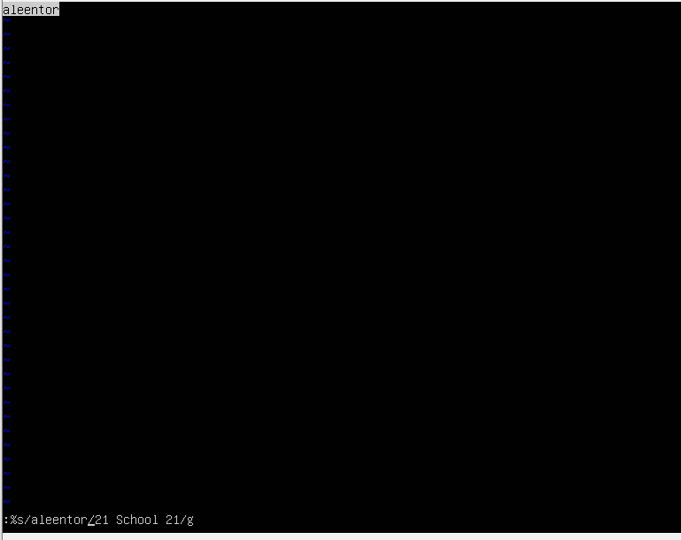
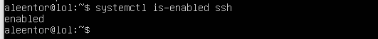

## Part 1. Установка ОС
+ Скриншот вывода команды

## Part 2. Создание пользователя
+  Вызов команды для создания пользователя

+ Вывод команды cat /etc/passwd

## 3. Настройка сети ОС
+ Задание названия машины

+ Установка времени

+ Вывод названий сетевых интерфейсов

+ `Интерфейс lo (loopback)` - это виртуальный интерфейс. Он является частью внутреннего стека. Он используется машиной для коммуникации с самим собой и полезен в диагностике и устранении неполадок.

+ Вывод IP

+ `DHCP (Dynamic Host Configuration Protocol англ.)` — протокол динамической настройки узла, позволяющий устройствам автоматически получать IP-адрес, данные о DNS-сервере и другие параметры, необходимые для работы в сети. Включает в себя следующие этапы: discovery (поиск), offer (предложение), request (запрос), acknowledgment (подтверждение).

+ Вывод внешнего IP

+ Вывод внутреннего IP

+ Редактируем конфига под нужные настройки используя `nano /etc/netplan/00-installer-config.yaml`
- Применяем изменения с помощью команды `sudo netplan apply`
- Перезагружаем систему `reboot`

+ Проверяем пинг командой `ping 1.1.1.1` и `ping ya.ru`

## 4. Обновление ОС
+ Обновление осуществлено. Обновления отсутствуют

## 5. Использование команды sudo
+ `Sudo` — команда, которая наделяет правами суперпользователя. Ее используют для выполнения с правами администратора. 
+ меняем hostname

## Part 6. Установка и настройка службы времени
- Проверяем есть ли обновления для apt-get `sudo apt-get update` и если все нормально устанавливаем ntp `sudo apt-get install ntp`

- Открываем файл с наименованием серверов `sudo vim /etc/ntp.coef` и дописываем сервера откуда будет браться время `ubuntu.pool.ntp.org` активируем NTP командой `sudo timedatectl set-ntp on`

- Устанавливаем systemd-timesyncd командой `sudo apt install systemd-timesyncd`

- Активируем NTP командой `sudo timedatectl set-ntp on`

- Проверяем результат и видим, что переменная `NTPSynchronized=yes`

## Part 7. Установка и использование текстовых редакторов
- Создаем файл через команду `vim test_vim.txt` прописываем в файле ник. Закрываем через команду esc: и вводим `wq`

- NANO Создаем файл через команду `nano test_nano.txt` прописываем в файле ник. Закрываем через команду cntrl+O, не изменяем имя файла и нажимаем enter, для выхода нахимаем cntrl+X

- Устанавливаем joe через команду `sudo apt install joe`. Создаем и открываем файл через команду `joe test_joe.txt`. Сохраняем файл через cntrl+k, для выхода нахимаем cntrl+X.

- Открываем файл через команду `vim test_vim.txt`, открываем на редактирование через команду shift+i, прописываем в файле `21 Shcool 21`. Закрываем без сохранения через команду esc: и вводим `q!`

- Открываем файл через команду `nano test_nano.txt`, прописываем в файле `21 Shcool 21`. Закрываем без сохранения через команду shift+X и вводим `n`

- Открываем файл через команду `joe test_joe.txt`, прописываем в файле `21 Shcool 21`. Закрываем без сохранения через команду ctrl+c и вводим `y`

- Открываем файл через команду `vim test_vim.txt `, открываем на редактирование через команду shift+:, прописываем '/ник'. То, что мы ищем, будет выделяться

- Для того чтобы заменить слово есть 3 варианта:
- `:%s/слово/новое_слово/g` - заменить все вхождения слова в файле на 'новое_слово'.
- `:%s/слово/новое_слово/gc` - то же, но с подтверждением замены каждого слова. Нажмите y для замены, n для пропуска.
- `:s/слово/новое_слово/g` - заменяет только первое вхождение на текущей строке.

- Открываем файл через команду `nano test_nano.txt `, открываем на поиск через команду Ctrl+W, нажимаем enter `ник`. То, что мы ищем, будет выделяться стрелкой.
  

+ Для начала откроем файл с которым будем работать, далее нажимаем комбинацию ALT+R и вводим то что ищем, жмем ENTER. На следующем шаге вводим то на что заменяем и снова жмакаем по ENTER. Клавишей Y мы подтверждаем одноразовую замену, а клавишей A — заменить все.

- Открываем файл через команду `joe test_joe.txt `, открываем на поиск через команду Ctrl+K,добавляем /`ник` нажиимаем enter. То что мы ищем, будет выделено.

- Открываем файл через команду `joe test_joe.txt `, открываем на поиск через команду Ctrl+K,добавляем /`ник` нажиимаем enter. То что мы ищем, будет контуром.
- Для замены нажмите Ctrl + K, затем введите `:21 school 21` и нажмите Enter
- Для замены всех вхождений фразы используйте Alt + G.
- Чтобы сохранить изменения и выйти, нажмите Ctrl + K, затем X.

## 8. Установка и базовая настройка сервиса SSHD
- Запускаем установку SSHD через команду `sudo apt install openssh-server`

- Добавим автостарт службы при запуске системы командой `sudo systemctl enable ssh`

- Рестартим ssh и проверяем чтобы он был enable `systemctl is-enabled ssh`

- Откроем файл конфигурации SSH для редактирования `nano /etc/ssh/sshd_config` и дописываем `Port 2022`

- Чтобы изменения вступли в силу рестартим систему `sudo systemctl restart sshd` 

- Проверяем изменения командой `ps aux | grep sshd` 

+ Ключи -tan означают:
  1. -t: Отображает только TCP соединения.
  2. -a: Показывает все активные сетевые соединения и прослушиваемые порты.
  3. -n: Отображает адреса и порты в числовом формате, без попытки определить доменное имя.
+ Значение столбцов таблицы:
  1. Proto - протокол используемый сокетом.
  2. Recv-Q - количество байтов, не скопированных локальным приложением.
  3. Send-Q - количество байтов, не подтвежденных удаленным хостом.
  3. Local Address - адрес и номер порта докального конца сокета.
  4. Foreign Address - адрес и номер порта удаленного конца сокета

- Используем команду для проверки `netstat -tan` вывод содержит `tcp 0 00.0.0.0:2022 0.0.0.0:* LISTEN`

## Part 9. Установка и использование утилит top, htop
- Для того чтобы открыть top прописываем `top`

- uptime `2:17`
- user `1`
- загрузка системы `по нулям`
- общее количество процессов `102`
- загрузку cpu `0`
- загрузку памяти

- `677` - pid процесса занимающего больше всего памяти. Комбинация shift+M

- `1 system` - pid процесса, занимающего больше всего процессорного времени. Комбинация shift+P

- процессы отсортированные по PID через F6

- процессы отсортированные по PERCENT_CPU через F6

- процессы отсортированные по PERCENT_MEM через F6

- процессы отсортированные по TIME через F6

- процессы отсортированные по TIME через F4 + sshd

- процессы отсортированные по TIME через F3 + syslog

- процессы выведенные через настройку F2 -> Hostname, clock, uptime

## Part 10. Использование утилиты fdisk
- Вывод команды `fdisk -l`

- Название жесткого диска – `VBOX HARDDISK`
- Размер жесткого диска – `15,5 GiB`
- Количество секторов жесткого диска – `31774352`
- swap жесткого диска определяем через команду `free -h`

## Part 11. Использование утилиты df

- Запуск команды `df /`

- размер раздела

- размер занятого пространства

- размер свободного пространства

- процент использования

- Единица измерения Кб

- Запуск команды `df – TH /`

- размер раздела

- размер занятого пространства

- размер свободного пространства

- процент использования

- тип файловой системы для раздела

## Part 12. Использование утилиты du
- Запуск команды du `sudo du`

- Выводим размер папок /home, /var, /var/log (в байтах) с флагами -s -h `sudo du -s -h /`

- Выводим размер всего содержимого в /var/log , используя * с флагами -s -h `sudo du -s -h /var/log/*`

## Part 13. Установка и использование утилиты **ncdu**
- Установка ncdu через команду `sudo apt install ncdu`

- Выводим размер папок /home `sudo ncdu /home`

- Выводим размер папок /var `sudo ncdu /var`

- Выводим размер папок /var/log `sudo ncdu /var/log`

## Part 14. Работа с системными журналами
- откроем логи для просмотра и анализа `nano /var/log/dmesg`

- откроем логи для просмотра и анализа `nano /var/log/syslog`

- откроем логи для просмотра и анализа `nano /var/log/auth.log`

- найдем в файле логов auth.log успешный вход в систему при запуске ПК 

- перезапустим службу sshd командой `sudo systemctl restart sshd.`

- в файлах логов syslog находим сообщение о рестарте

## Part 15. Использование планировщика заданий CRON
- Запустим crontab командой `crontab -e`, после запуска необходимо выбрать в каком редакторе открыть, выбираем nano `5`
- Добавляем строчку `*/2 * * * * uptime` в файл и выходим с сохранением

- Смотрим появились ли задачи командой `crontab -l`, видим строчку `*/2 * * * * uptime`, значит все хорошо

- Открываем лог и смотрим выполняется ли задача раз в 2 минуты `nano /var/log/syslog`

- Удаляем все задания из планировщика командой `crontab -r`, проверяем есть ли задания командой `crontab -l` и видим что ничего не осталось.

